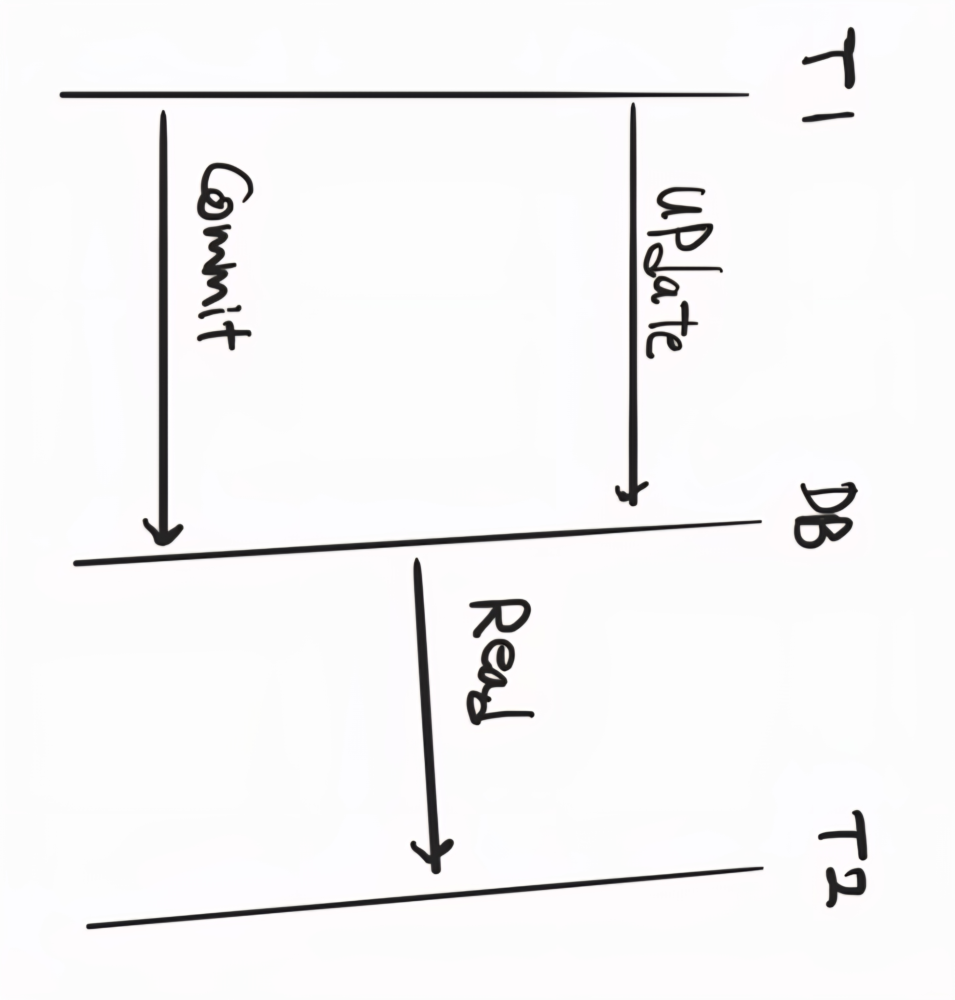
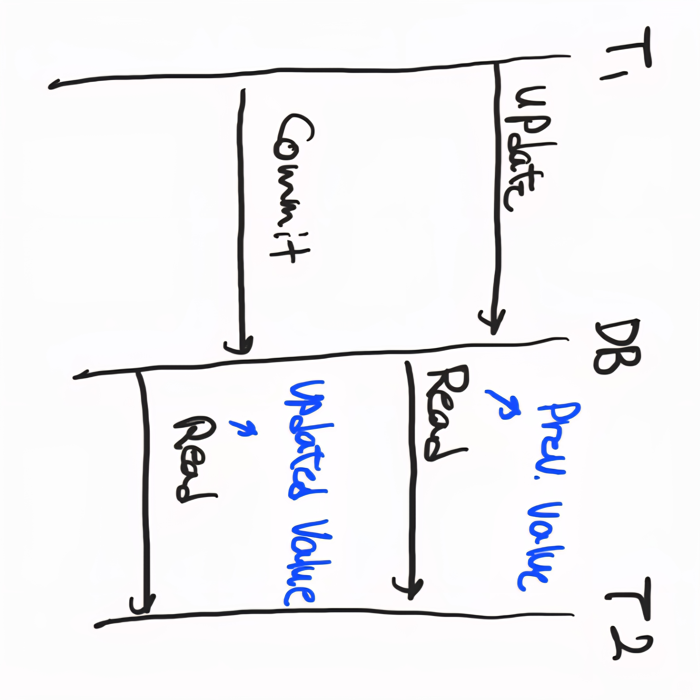
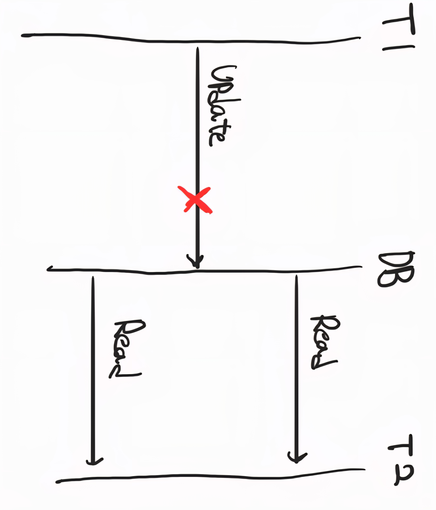

# Relational Data Base
- 개체, 관계, 속성으로 구성되는 관계형 데이터 모델에 기반한 데이터베이스.
## 구성 요소.
- 개체 : 테이블.
- 튜플, 레코드, row : 칼럼들의 집합, 실제 데이터 하나.
- 속성, column : 세로 줄. 데이터의 특정한 속성을 지칭.
- 관계, relation : 1:N, N:M 등 FK를 활용한 Table 간의 관계성을 나타냄.

 

## Schema
- DB 구조에 대한 정의.
- CRUD가 발생할 때 DBMS는 DB Schema를 참조하여 작업을 수행.
- 현장에서는 테이블 소유자 개념으로 통용, 오라클은 OWNER 명, MariaDB, DB2 등에서는 DB 명을 뜻함.

### 외부 schema
- 사용자나 응용 프로그램이 접근할 수 있는 정의 기술.
- 사용자 관점, 사용자 뷰 표현.
- 특정 정보에 대해서만 사용자가 접근할 수 있도록 하는 보안성 및 편의성 기능을 제공.
- ex: 사용자 VIEW, SQL 이용

### 개념 schema
- 데이터베이스 내의 모든 데이터에 관한 규칙과 의미 정의.
- 개체간의 관계, 제약조건, 권한, 보안, 무결성.
- 논리적 엔티티.

### 내부 schema
- 데이터 베이스의 물리적 저장 방법.
- OS, HW에 종속적.
- 물리적 주소.

 

## System catalog
- DB를 구성하는 schema 구조를 저장, 논리적 관계와 권한등을 저장하는 메타 데이터 기능.

| 범주              | 저장 정보                                |
| --------------- | ------------------------------------ |
| 🔸 테이블          | 테이블 이름, 생성일자, 속성 목록, 데이터 타입, 제약 조건 등 |
| 🔸 열(Column)    | 열 이름, 데이터 타입, NULL 허용 여부, 기본값 등      |
| 🔸 인덱스          | 어떤 테이블의 어떤 열에 존재하는지, 인덱스 종류          |
| 🔸 뷰(View)      | 뷰 정의 쿼리, 관련된 테이블                     |
| 🔸 사용자          | 사용자 ID, 권한, 소유한 객체 등                 |
| 🔸 권한           | 테이블/열/뷰에 대한 SELECT, INSERT 등의 권한 정보  |
| 🔸 트리거, 저장 프로시저 | 정의 정보 및 연결된 테이블/이벤트                  |
| 🔸 통계 정보        | 테이블/인덱스의 레코드 수, 평균 길이 등 (쿼리 최적화에 사용) |

 

## 무결성
### 종류
- 개체 무결성 : PK, 식별자의 존재의 필요성.
- 참조 무결성 : 참조 관계에 있는 두 테이블의 데이터는 항상 일관된 값을 가져야함. FK.
- 속성 무결성 : 각 도메인별로 존재하는 제약 조건에 맞는 튜플만이 존재해야함.
- 사용자 정의 무결성 : 사용자가 정의하는 무결성 조건. 제약 조건, 트리거.

### 구현 방안
- 선언적 방법 : DBMS에서 제공하는 기능. 제약 조건.
- 절차적 방법 : 응용 로직으로 구현하는 방법. Trigger, 저장 프로시저, 함수, 기타 응용 로직.

## Transaction
- 데이터의 일관성 및 정합성 유지를 위해 ACID를 지원하는 논리적 업무단위.
### ACID
- Atomicity : 하나의 transaction은 모두 완료되거나 취소되어야 함.
- Consistency : transaction 성공시 언제나 모순이 없어야 함. (제약 조건, 요구 논리 조건 충족)
- Isolation : transaction 간의 연산 결과가 실행 중에 서로 영향을 주어서는 안됨. 정합성, 동시성의 trade off
- Durability : 완료된 transaction은 어떤 고장에도 손실되어서는 안된다.

## 동시성 제어 (Concurrency Control)
### 발생 가능한 오류
- 갱신 분실 : 동일 데이터를 동시에 갱신할 경우에 마지막 업데이트만 반영되는 오류.
- 불일치 : 특정 항목을 읽기 전에 다른 transaction에서 업데이트가 발생하여 데이터가 불일치하는 현상.
- 연쇄 복귀 : 복수의 transaction이 rollback 연산을 수행할 경우 다른 transaction이 완료한 부분을 rollback할 수 없는 문제.

### Lock (비관적)
- transaction이 사용하는 자원에 대하여 상호 배제를 지원하는 기법.
- shared lock : 읽기 전용. 다른 읽기 요청을 동시에 받을 수 있음.
- exclusive lock : 데이터를 변경할 때 사용. 자원에 대한 읽기와 변경이 불가능.
- dead lock : A transaction이 X를 잠그고 Y를 기다리고 B transaction이 Y를 잠그고 X를 기다리는 경우 교착 상태가 발생하는 문제.

### MVCC (낙관적)
- 읽기 일관성과 동시성을 동시에 확보하기 위한 방법.
- 데이터 변경이 발생할 때마다, 해당 변경을 원본에 반영하는 것이 아니라, 변경사항을 반영한 버전을 생성.
- 이렇게 하면 쿼리 시작 시점의 일관된 데이터를 읽어올 수 있기 때문에 읽기 - 쓰기에서 발생하는 문제를 해결 가능하다. (transaction 사이의 독립성 확보)
- 모든 문제를 해결할 수는 없고, 정합성과 병렬성 사이의 trade-off를 고려해서 serilalizable 격리 수준을 사용할 때도 있음.
- db 별로 지원하는 방식은 다르다.

### Isolation
#### Isolation level 0 - Read Uncommitted
- READ 과정에서 shared lock이 존재하지 않음.
- 따라서 commit 되지 않은 데이터를 읽을 수 있음. (Dirty Read)

#### Isolation level 1 - Read Committed
- Commit된 데이터만을 읽어오는 것을 허용.
- Transaction 수준의 일관성 보장 안됨.
- SELECT시 조건에 만족하는 데이터 중 cursor가 fetch 중인 데이터만 shared lock 발생.
- 데이터를 변경하는 중에는 해당 데이터에 접근 불가능.

#### Isolation level 2 - Repeatable Read
- Transaction이 완료될 때까지 조건에 부합하는 모든 데이터에 shared lock이 발생.
- Transaction 단위의 읽기 일관성 보장.
- row 2, 3에 대한 작업을 수행하고 있으면 2, 3 row에 대한 업데이트는 불가능 하지만 새 tuple을 삽입하는 것은 가능.

#### Isolation level 3 - Serializable
- SELECT 수행 시 shared lock 사용.
- transaction이 완료될 떄 까지 해당하는 모든 데이터에 lock이 발생하여 다른 사용자는 해당 영역에 접근할 수 없음.
- 동시성이 최저.
- row 2,3에 대한 작업을 수행하고 있으면 새로운 row를 추가하거나 해당 row에 대한 update 불가능.