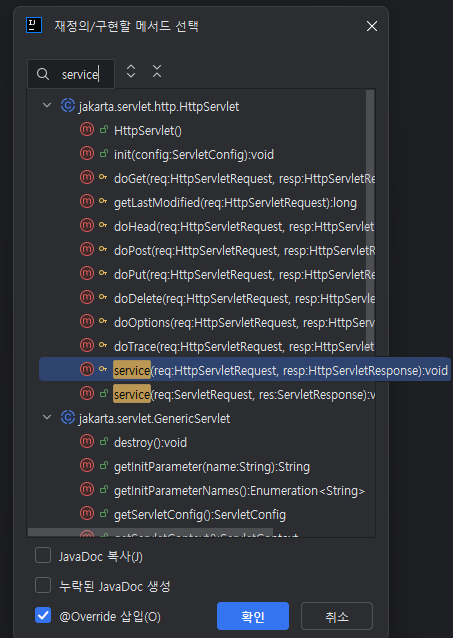

# Servlet 맛보기
- Servlet을 사용한 간단한 서버 구축 및 test.

## 1. ServletApplication.java
- `src\main\java\hello.servlet`에 위치.
- `@ServletComponentScan`을 작성한다.
```java
@ServletComponentScan
@SpringBootApplication
...
```
- ServletComponentScan : `@WebServlet`, `@WebFilter`, `@WebListener`등의 annotation을 자동으로 감지.

</br>

## 2. hello.servlet\basic\HelloServlet.java
- basic package 만들고 해당 폴더 내에서 class 만들기.
### 2-1. Annotation 및 상속
1. `@WebServlet(name="helloServlet", urlPatterns="/hello")`
    - name, urlPatterns는 중복되어서는 안됨.
2. `public class HelloServlet extends HttpServlet`
```java
@WebServlet(name = "helloServlet", urlPatterns = "/hello")
public class HelloServlet extends HttpServlet {
    ...
}
```

### 2-2. service method
- 특정 주소로 요청을 보냈을 때 응답할 로직을 작성.
- ctrl + O : method 자동 작성 가능. -> service 검색해서 열쇠 모양 method 선택.



### 2-3. 예제 로직
```java
@WebServlet(name = "helloServlet", urlPatterns = "/hello")
public class HelloServlet extends HttpServlet {

    @Override
    protected void service(HttpServletRequest request, HttpServletResponse response) throws ServletException, IOException {
        System.out.println("HelloServlet.service");  // soutm
        System.out.println("request = " + request);  // soutv
        System.out.println("response = " + response);  // soutv

        String userName = request.getParameter("username");  // url parameter 읽기
        System.out.println(userName);

        response.setContentType("text/plain");  // response content type 설정
        response.setCharacterEncoding("utf-8");  // response encoding 설정
        response.getWriter().write("hello " + userName);  // writer를 통해 특정 문구 반환.
    }
}
```

## 3. html files
- 기본적으로 `src\main\webapp` 경로에 저장.
- index.html 파일은 루트 url로 요청을 보냈을 때 응답할 html 파일.

# ETC
## debugging