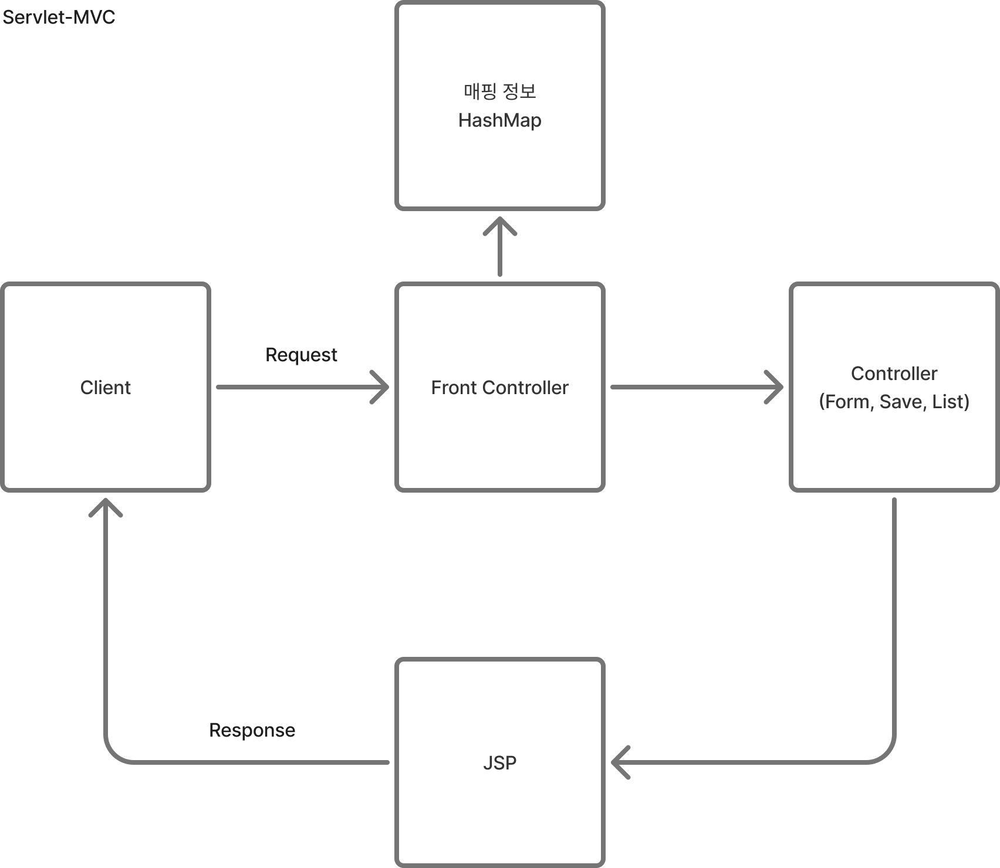
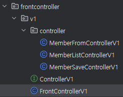
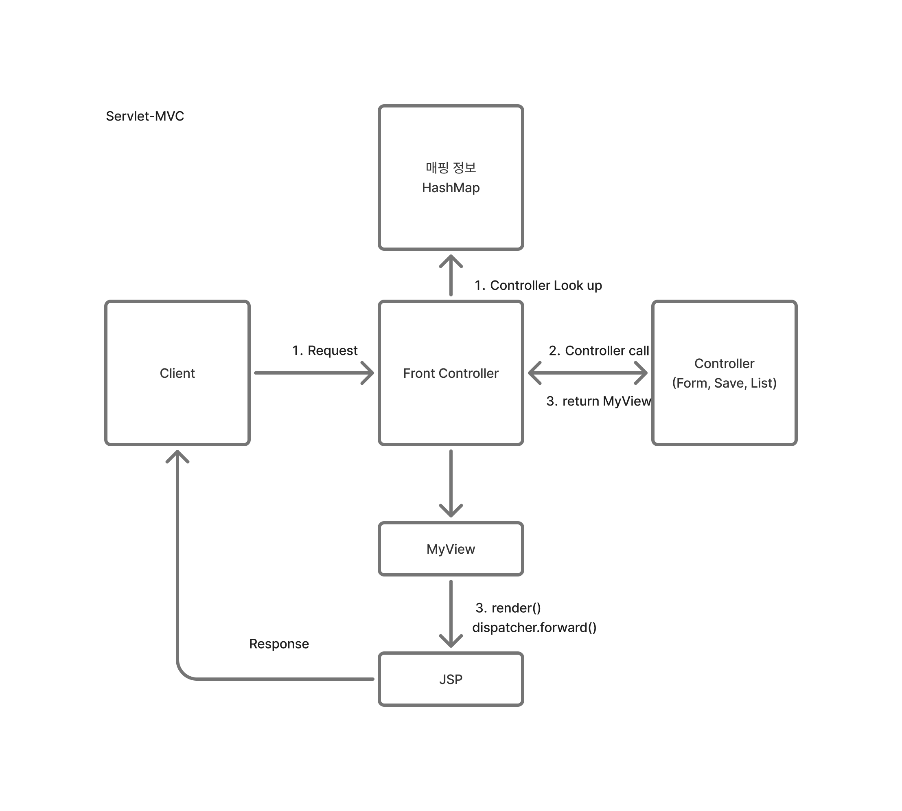
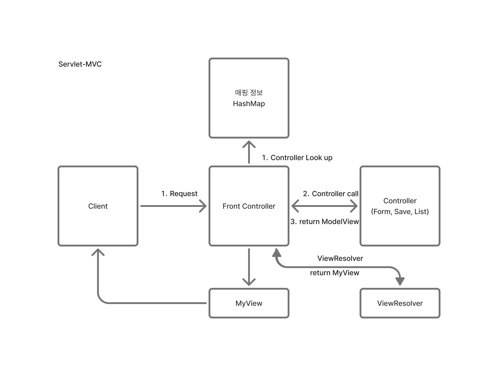
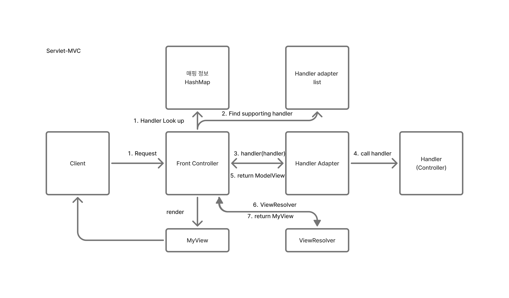

# Servlet - MVC1
- Servlet에서 비즈니스 로직을 좀 더 깔끔하게 관리하기 위해서 front controller를 도입.


## 구조
- 각 Controller에 대해 적용할 `interface`를 작성한다.
- Form, List, Save Controller에 대해서 interface를 implement하여 구조를 강제하고, Front Contoller에서는 적절한 controller를 호출한다.





</br>

## 구현
- front controller는 HTTP 요청을 받으면 해당 요청의 URI를 사용해서 적절한 Controller로 이어준다.
- Controller는 request, response를 바탕으로 비즈니스 로직을 수행하고, 적절한 jsp 파일을 render한다.

### Interface
```java
public interface ControllerV1 {
    void process(HttpServletRequest request, HttpServletResponse response) throws ServletException, IOException;
}
```

### Front Controller

```java
@WebServlet(name = "frontControllerV1", urlPatterns = "/front-controller/v1/*")
public class FrontControllerV1 extends HttpServlet {

    private Map<String, ControllerV1> controllerMap = new HashMap<>();

    public FrontControllerV1() {
        controllerMap.put("/front-controller/v1/members/new-form", new MemberFromControllerV1());
        controllerMap.put("/front-controller/v1/members/save", new MemberSaveControllerV1());
        controllerMap.put("/front-controller/v1/members", new MemberListControllerV1());
    }

    @Override
    protected void service(HttpServletRequest request, HttpServletResponse response) throws ServletException, IOException {
        String requestURI = request.getRequestURI();

        ControllerV1 controller = controllerMap.get(requestURI);
        if (controller == null) {
            response.setStatus(HttpServletResponse.SC_NOT_FOUND);
            return;
        }

        controller.process(request, response);
    }
}

```

</br>
</br>

# Servlet - MVC2
- MVC1에서 jsp rendering하는 logic는 controller에 무관하게 중복되어 나타난다.
- 해당 view를 별도의 class로 지정하고, 관련된 기능을 묶어서 관리하면 코드의 유지 보수 측면에서 강점을 가진다.

## 구조
- V1과 유사한 구조를 가지나, MyView class에서 view 관련 로직을 모두 처리한다.
- `render` method를 통해 jsp 파일을 불러오고, 사용자에게 응답한다.




</br>


## 구현
- 이전의 V1에서 View 관련 로직을 MyView 클래스에서 관리하도록 수정한다.
- Interface를 수정하여 반환 값을 MyView로 수정한다.
- 이때, viewPath는 jsp 파일이 위치한 경로가 되도로고 로직을 작성한다.

### Controller Interface
```java
public interface ControllerV2 {

    MyView process(HttpServlet request, HttpServletResponse response) throws ServletException, IOException;
}
```

### Front Controller
```java
@WebServlet(name = "frontControllerV2", urlPatterns = "/front-controller/v2/*")
public class FrontControllerV2 extends HttpServlet {
    private Map<String, ControllerV2> controllerMap = new HashMap<>();

    public FrontControllerV2() {
        controllerMap.put("/front-controller/v2/members/new-form", new MemberFormControllerV2());
        controllerMap.put("/front-controller/v2/members/save", new MemberSaveControllerV2());
        controllerMap.put("/front-controller/v2/members", new MemberListControllerV2());
    }

    @Override
    protected void service(HttpServletRequest request, HttpServletResponse response) throws ServletException, IOException {
        System.out.println("FrontControllerV2.service");

        String requestURI = request.getRequestURI();
        ControllerV2 controller = controllerMap.get(requestURI);
        if (controller == null) {
            response.setStatus(HttpServletResponse.SC_NOT_FOUND);
            return;
        }

        MyView view = controller.process(request, response);
        view.render(request, response);
    }
}
```

</br>
</br>


# Servlet - MVC3
- 데이터와 관련된 `request.getParameter` 부분을 각 Controller에서 처리하도록 한다.
- Model을 관리하는 객체를 추가.

## 구조
- Controller에서 Model 관련 정보를 처리하여 하나의 객체로 관리하도록 한다.
- Model View class를 만들고, 해당 class에서 jsp에서 사용할 인자들을 관리하게 한다.
- ParamMap을 인자로 받아 로직을 처리하도록 interface를 작성한다.
- 이제 Controller는 request를 직접 받지 않고 로직을 처리할 수 있다.
- paramMap을 FrontController가 주면, 해당 인자를 바탕으로 비즈니스 로직을 처리하고, ModelView를 적절히 생성하여 반환한다.
- request, response의 불필요한 정보가 오가지 않고, parameter 정보만 전달할 수 있다.



## 구현

### Controller Interface
```java
public interface ControllerV3 {
    ModelView process(Map<String, String> paramMap);
}
```

- `ViewResolver`를 만들어 `ModelView`의 논리적 이름을 바탕으로 jsp 파일의 물리 경로를 계산하도록 한다.

### Controller Interface

```java
...
@WebServlet(name = "frontControllerV3", urlPatterns = "/front-controller/v3/*")
public class FrontControllerV3 extends HttpServlet {
    private Map<String, ControllerV3> controllerMap = new HashMap<>();

    public FrontControllerV3() {
        controllerMap.put("/front-controller/v3/members/new-form", new MemberFormControllerV3());
        controllerMap.put("/front-controller/v3/members/save", new MemberSaveControllerV3());
        controllerMap.put("/front-controller/v3/members", new MemberListControllerV3());
    }

    @Override
    protected void service(HttpServletRequest request, HttpServletResponse response) throws ServletException, IOException {
        System.out.println("FrontControllerV3.service");

        String requestURI = request.getRequestURI();
        ControllerV3 controller = controllerMap.get(requestURI);
        if (controller == null) {
            response.setStatus(HttpServletResponse.SC_NOT_FOUND);
            return;
        }


        // 1. paramMap -> ModelView class
        Map<String, String> paramMap = createParamMap(request);
        ModelView mv = controller.process(paramMap);

        // 2. viewResolver
        // view의 논리 이름, new-form 같은 viewName만 있으니, viewResolver가 있어야한다.
        String viewName = mv.getViewName();
        MyView view = viewResolver(viewName);

        // 3. render
        view.render(mv.getModel(), request, response);
    }

    private static MyView viewResolver(String viewName) {
        return new MyView("/WEB-INF/views/" + viewName + ".jsp");
    }

    private static Map<String, String> createParamMap(HttpServletRequest request) {
        Map<String, String> paramMap = new HashMap<>();
        request.getParameterNames().asIterator()
                .forEachRemaining(paramName -> paramMap.put(paramName, request.getParameter(paramName)));
        return paramMap;
    }
}
```
</br>
</br>

# Servlet - MVC4
- version 3에서 modelView를 반환하는 대신, model을 별도로 관리하여 Controller에서 rendering에 필요한 정보를 model에 put 하도록 로직을 수정한다.
## 구조


</br>

## 구현

### Controller Interface
```java
public interface ControllerV4 {
    /**
     *
     * @param paramMap
     * @param model
     * @return
     */
    String process(Map<String, String> paramMap, Map<String, Object> model);
}

```

### Front Controller
```java
...
@WebServlet(name = "frontControllerV4", urlPatterns = "/front-controller/v4/*")
public class FrontControllerServletV4 extends HttpServlet {

    private Map<String, ControllerV4> controllerMap = new HashMap<>();

    public FrontControllerServletV4() {
        controllerMap.put("/front-controller/v4/members/new-form", new MemberFormControllerV4());
        controllerMap.put("/front-controller/v4/members/save", new MemberSaveControllerV4());
        controllerMap.put("/front-controller/v4/members", new MemberListControllerV4());
    }

    @Override
    protected void service(HttpServletRequest request, HttpServletResponse response) throws ServletException, IOException {
        System.out.println("FrontControllerServletV4.service");
        String requestURI = request.getRequestURI();
        System.out.println("requestURI = " + requestURI);

        // 1. URI 바탕으로 controller 가져오기.
        ControllerV4 controller = controllerMap.get(requestURI);
        System.out.println("controller = " + controller);
        // 1-1. controller 없을 경우 NOT_FOUND 반환.
        if (controller == null) {
            response.setStatus(HttpServletResponse.SC_NOT_FOUND);
            return;
        }

        // 2. create ParamMap
        Map<String, String> paramMap = createParamMap(request);
        Map<String, Object> model = new HashMap<>();
        String viewName = controller.process(paramMap, model);

        // 3. viewResolver
        MyView view = viewResolver(viewName);

        view.render(model, request, response);
    }

    private static MyView viewResolver(String viewName) {
        return new MyView("/WEB-INF/views/" + viewName + ".jsp");
    }

    private Map<String, String> createParamMap(HttpServletRequest request) {
        Map<String, String> paramMap = new HashMap<>();
        request.getParameterNames().asIterator()
                .forEachRemaining(paramName -> paramMap.put(paramName, request.getParameter(paramName)));
        return paramMap;
    }
}

```
</br>
</br>

# Servlet - MVC5
- 여러 Version의 Controller를 통합하는 방법을 구현한다.
- 개발자 관점에서 `ModelView`를 반환하는 V3를 쓰고 싶을 때가 있을 수 있고, `viewName`을 반환하는 V4가 쓰고 싶을 때가 있을 수 있다.
- 그러나 둘의 반환값이 다르므로, 현재 구조를 그대로 적용하는 것은 불가능하다.
- 따라서 controller와 front controller 사이에 adapter를 배치하여 적절한 변환 및 로직을 작성한다.

## 구조


</br>

## 구현
### Adapter interface & Adapter
```java
// MyHandlerAdapter
public interface MyHandlerAdapter {

    boolean supports(Object handler);

    ModelView handle(HttpServletRequest request, HttpServletResponse response, Object handler) throws ServletException, IOException;
}
```
```java
public class ControllerV3HandlerAdapter implements MyHandlerAdapter {

    @Override
    public boolean supports(Object handler) {
        return (handler instanceof ControllerV3);
    }

    @Override
    public ModelView handle(HttpServletRequest request, HttpServletResponse response, Object handler) throws ServletException, IOException {
        ControllerV3 controller = (ControllerV3) handler;

        Map<String, String> paramMap = createParamMap(request);
        ModelView mv = controller.process(paramMap);

        return mv;
    }

    private static Map<String, String> createParamMap(HttpServletRequest request) {
        Map<String, String> paramMap = new HashMap<>();
        request.getParameterNames().asIterator()
                .forEachRemaining(paramName -> paramMap.put(paramName, request.getParameter(paramName)));
        return paramMap;
    }
}
```
```java
public class ControllerV4HandlerAdapter implements MyHandlerAdapter {

    @Override
    public boolean supports(Object handler) {
        return (handler instanceof ControllerV4);
    }

    @Override
    public ModelView handle(HttpServletRequest request, HttpServletResponse response, Object handler) throws ServletException, IOException {
        ControllerV4 controller = (ControllerV4) handler;

        Map<String, String> paramMap = createParamMap(request);
        HashMap<String, Object> model = new HashMap<>();

        String viewName = controller.process(paramMap, model);

        ModelView mv = new ModelView(viewName);
        mv.setModel(model);

        return mv;
    }

    private Map<String, String> createParamMap(HttpServletRequest request) {
        Map<String, String> paramMap = new HashMap<>();
        request.getParameterNames().asIterator()
                .forEachRemaining(paramName -> paramMap.put(paramName, request.getParameter(paramName)));
        return paramMap;
    }
}

```

### FrontController
```java
// FrontControllerServletV5
@WebServlet(name = "frontControllerServletV5", urlPatterns = "/front-controller/v5/*")
public class FrontControllerServletV5 extends HttpServlet {

    private final Map<String, Object> handlerMappingMap = new HashMap<>();
    private final List<MyHandlerAdapter> handlerAdapters = new ArrayList<>();

    public FrontControllerServletV5() {
        initHandlerMappingMap();
        initHandlerAdapters();
    }

    private void initHandlerMappingMap() {
        handlerMappingMap.put("/front-controller/v5/v3/members/new-form", new MemberFormControllerV3());
        handlerMappingMap.put("/front-controller/v5/v3/members/save", new MemberSaveControllerV3());
        handlerMappingMap.put("/front-controller/v5/v3/members", new MemberListControllerV3());

        // add v4
        handlerMappingMap.put("/front-controller/v5/v4/members/new-form", new MemberFormControllerV4());
        handlerMappingMap.put("/front-controller/v5/v4/members/save", new MemberSaveControllerV4());
        handlerMappingMap.put("/front-controller/v5/v4/members", new MemberListControllerV4());
    }

    private void initHandlerAdapters() {
        handlerAdapters.add(new ControllerV3HandlerAdapter());
        handlerAdapters.add(new ControllerV4HandlerAdapter());
    }

    @Override
    protected void service(HttpServletRequest request, HttpServletResponse response) throws ServletException, IOException {

        // 1. request의 URI 기반으로 handler를 가져오기.
        Object handler = getHandler(request);

        if (handler == null) {
            response.setStatus(HttpServletResponse.SC_NOT_FOUND);
            return;
        }

        // 2. 조건에 부합하는 handler adapter 가져오기.
        MyHandlerAdapter adapter = getHandlerAdapter(handler);

        // 3. apdater.handle을 통해서 mv 반환.
        // controller 실행한 것과 동일.
        ModelView mv = adapter.handle(request, response, handler);

        String viewName = mv.getViewName();
        MyView view = viewResolver(viewName);

        view.render(mv.getModel(), request, response);

    }

    private MyView viewResolver(String viewName) {
        return new MyView("/WEB-INF/views/" + viewName + ".jsp");
    }

    private MyHandlerAdapter getHandlerAdapter(Object handler) {
        for (MyHandlerAdapter adapter : handlerAdapters) {
            if (adapter.supports(handler)) {
                return adapter;
            }
        }
        throw new IllegalArgumentException("handler adapter를 찾을 수 없습니다. handlers=" + handler);
    }

    private Object getHandler(HttpServletRequest request) {
        String requestURI = request.getRequestURI();
        return handlerMappingMap.get(requestURI);
    }
}

```