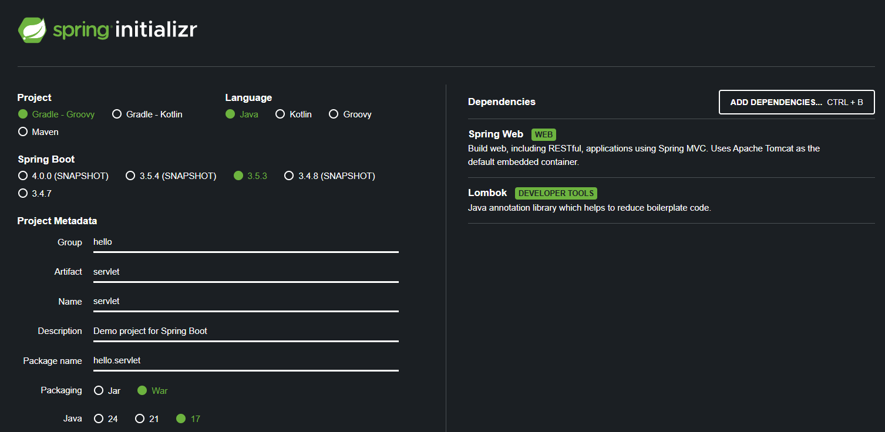

# I. 시작하기
## i. Spring Initializer
- Spring Initializer를 사용하면 프로젝트를 간단하게 실행가능.
- https://start.spring.io/
- 아래와 같이 설정. (강의 기준)

 

## ii. Intellij
### server 실행하기
- Intellij에서 build.gradle 열기.
- 설치 완료되면 src\main\java\ServletApplication.java 실행. (실행 안되면 gradle 동기화 수행)
- Tomcat Server 실행된 것 확인하고, localhost:8080으로 접속하여 white error page 확인.
### 관련 설정
1. 실행 관련
- file > settings에서 gradle로 이동.
- build and run관련 옵션 2개를 Intellij로 변경. (하면 에러 발생. 하지 말 것.)
2. Lombok plugin
- file > settings > plugin
- marketplace에서 lombok 설치, Intellij 재시작.
- file > settings > Annotation Proseccors에서 Enable annotation processing 활성화.