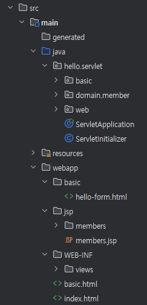

# JSP
- Html 파일을 java code에서 `writer.write(<html>)`이런 식으로 작성하는 것은 매우 비효율 적임.
- 따라서, jsp 파일을 사용하면 java code에서 html을 작성하는 것이 아니라, html 파일에서 필요한 로직을 작성할 수 있다.
- django의 DTL과 유사한 기능을 수행하는 파일.
- 단, 최근에는 JSP를 많이 사용하지 않는 추세이므로, 사용법을 심도있게 익히는 것은 비효율적.
- jsp 파일 또한 webapp 폴더 내에 위치 시킨다.


## Setup
- jsp에서 MVC 패턴을 사용하는 방법을 기술한다.
- build.gridle에 implementation을 작성한다.

### spring boot version < 3.0
```build.gridle
build.gradle 에 추가 ```groovy
//JSP 추가 시작
implementation 'org.apache.tomcat.embed:tomcat-embed-jasper'
implementation 'javax.servlet:jstl'
//JSP 추가 끝
```

### spring boot version > 3.0
```build.gridle
//JSP 추가 시작
implementation 'org.apache.tomcat.embed:tomcat-embed-jasper'
implementation 'jakarta.servlet:jakarta.servlet-api' //스프링부트 3.0 이상
implementation 'jakarta.servlet.jsp.jstl:jakarta.servlet.jsp.jstl-api' //스프링부트 3.0 이상
implementation 'org.glassfish.web:jakarta.servlet.jsp.jstl' //스프링부트 3.0 이상
//JSP 추가 끝
```

</br>

## Basic
- java code를 jsp 파일에 작성하는 기본 예제.
- `HttpServlet`에서 작성했던 코드를 jsp로 옮겨서 작성할 수 있다.
- 비즈니스 로직과 html을 한번에 작성하는 강점을 가진다.
- 그러나, 한 파일에서 서로 다른 기능을 한번에 관리하면 유지 보수 및 변경점 추적에 어려움을 겪는다.

```jsp
<%@ page contentType="text/html;charset=UTF-8" language="java" %>
<%@ page import="hello.servlet.domain.member.Member"%>
<%@ page import="hello.servlet.domain.member.MemberRepository"%>

<%
    // request, response 사용 가능.
    // jsp도 servlet으로 변환되어 실행되기 때문.
    MemberRepository memberRepository = MemberRepository.getInstance();  // 99.Singleton.md 파일 참조.

    System.out.println("MemberSaveServlet.service");
    String username = request.getParameter("username");
    int age = Integer.parseInt(request.getParameter("age"));

    Member member = new Member(username, age);
    memberRepository.save(member);
%>
<html>
<head>
 <meta charset="UTF-8">
</head>
<body>
성공
<ul>
 <li>id=<%=member.getId()%></li>
 <li>username=<%=member.getUsername()%></li>
 <li>age=<%=member.getAge()%></li>
</ul>
<a href="/index.html">메인</a>
</body>
</html>
```


</br>
</br>

# ETC
## dir 구조
