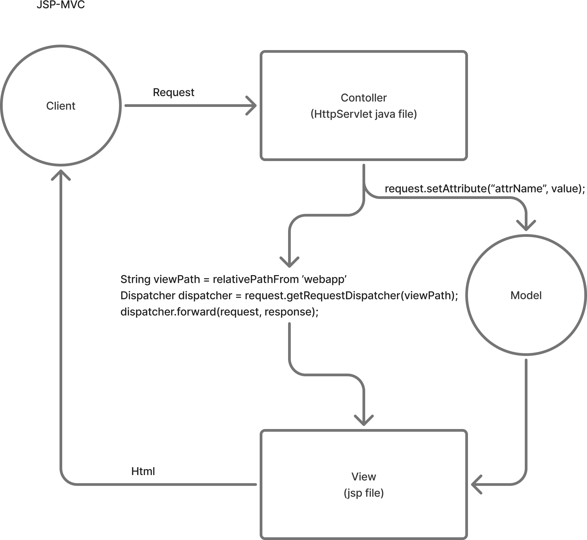

# JSP-MVC
- jsp 파일에 java 코드를 길게 작성하는 것은 가독성 측면에서 손실이 크다.
- 따라서 MVC pattern을 활용하여 controller와 view를 분리한다.
- model을 controller와 view 중간에서 데이터를 임시 저장하는 역할을 한다.
- servlet 규칙으로 jsp view에 사용할 jsp 파일은 `webapp>WEB-INF` 안에 관리한다.



## contoller
- 비즈니스 로직을 처리하는 java file.
- 아래는 회원 목록을 조회하는 controller
```java
@WebServlet(name = "mvcMemberListServlet", urlPatterns = "/servlet-mvc/members")
public class MvcMemberListServlet extends HttpServlet {

    private MemberRepository memberRepository = MemberRepository.getInstance();

    @Override
    protected void service(HttpServletRequest request, HttpServletResponse response) throws ServletException, IOException {
        // 1. memberRepository를 통해 members 목록을 가져온다. (비즈니스 로직)
        ArrayList<Member> members = memberRepository.findAll();

        // 2. setAttribute method를 통해 model에 members를 저장한다.
        request.setAttribute("members", members);

        // 3. viewPath를 지정하고, 해당 viewPath로 dispatcher 객체를 생성, forward를 수행한다.
        String viewPath = "/WEB-INF/views/members.jsp";
        RequestDispatcher dispatcher = request.getRequestDispatcher(viewPath);
        dispatcher.forward(request, response);

    }
}
```

</br>

## view
- c tag는 jsp에서 지원하는 html tag로, rendering되지는 않고, jsp의 고유 로직을 실행하기 위해 쓰이는 tag이다.
- 비즈니스 로직이 없고, rendering을 위한 forEach 로직 정도만 jsp에 작성됨을 확인할 수 있다.

```jsp
<%@ page contentType="text/html;charset=UTF-8" language="java" %>
<%@ taglib prefix="c" uri="http://java.sun.com/jsp/jstl/core"%>
<html>
<head>
 <meta charset="UTF-8">
 <title>Title</title>
</head>
<body>
<a href="/index.html">메인</a>
<table>
 <thead>
 <th>id</th>
 <th>username</th>
 <th>age</th>
 </thead>
 <tbody>
 <c:forEach var="item" items="${members}">
 <tr>
 <td>${item.id}</td>
 <td>${item.username}</td>
 <td>${item.age}</td>
 </tr>
 </c:forEach>
 </tbody>
</table>
</body>
</html>
```
