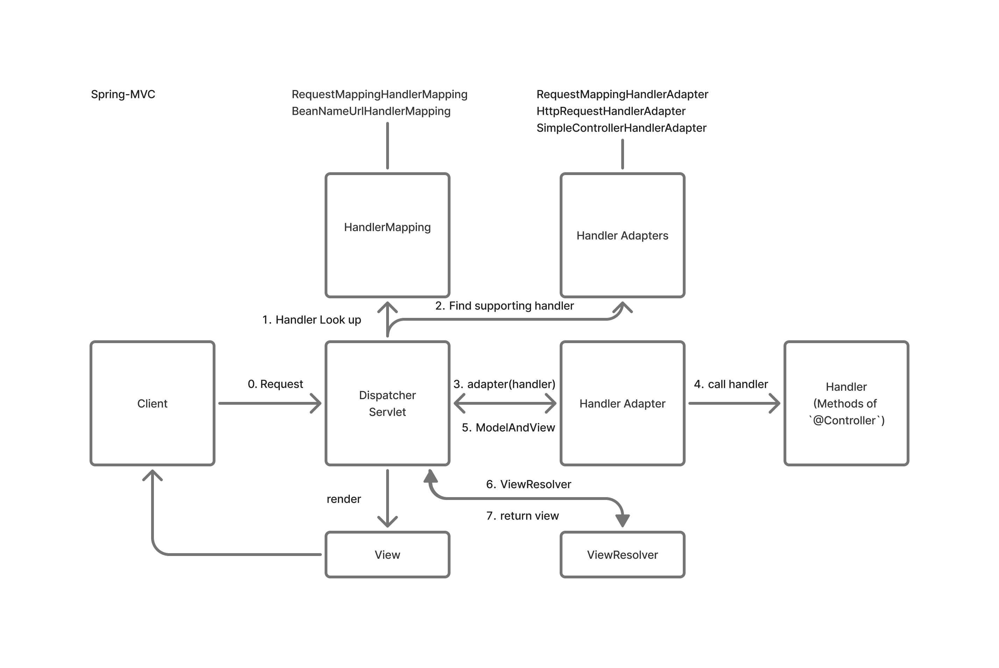

# Spring Structure
Spring 프레임워크는 이전에 Servlet으로 만든 MVC Pattern과 동일한 구조로 만들어져 있다.

## 구조


### HandlerMapping
- URI에 대한 적절한 Handler를 찾는 components.
- Handler를 작성하는 방법은 최신의 `annotation` 기반과 과거 `interface` 기반이 있는데, spring에서는 두 가지 모두를 지원.
- `Annotation` 기반의 `Controller` (handler)를 먼저 찾고, 그 다음 `BeanName` 기반의 `Controller` 를 찾는다.

### Handler Adapters (List of Adapters)
- 찾은 Handler에 적합한 adapter를 목록에서 찾는다.
- 마찬가지로 `annotation` 기반의 adapter를 먼저 확인한다.

### Handler Adapter
- `RequestMappingHandlerAdapter` 와 같은 특정 Adapter를 통해 `Controller`(Handler) 를 호출한다.
- Controller 는 비즈니스 로직을 수행하고 `ModelAndView` 또는 String 등의 객체를 반환한다.
- 이후 adapter가 적절한 형변환을 통해 `ModelAndView` 형태로 Dispatcher Servlet에 넘겨준다.

### Handler (Controller)
- 비즈니스 로직을 처리하는 component.
- 백엔드 개발을 하면 로직의 대부분을 해당 component에 작성한다.

### ViewResolver
- View Name을 바탕으로 View 관련 로직을 수행하는 component.
- Spring에서는 Interface 형태로 구현되어 확장이 용이하다.
- ViewName 을 사용하여 View 관련 로직을 처리하기 위해서는 아래와 같이 prefix 와 suffix 를 작성해야한다.
```text
spring.mvc.view.prefix=/WEB-INF/views/
spring.mvc.view.suffix=.jsp
```

### Dispatcher Servlet
- Servlet MVC pattern에서 Front Controller의 역할을 담당하는 Component.
- Request를 받고 Adapter, Mapping, ViewResolver 등과 연결되어 있는 핵심 component.