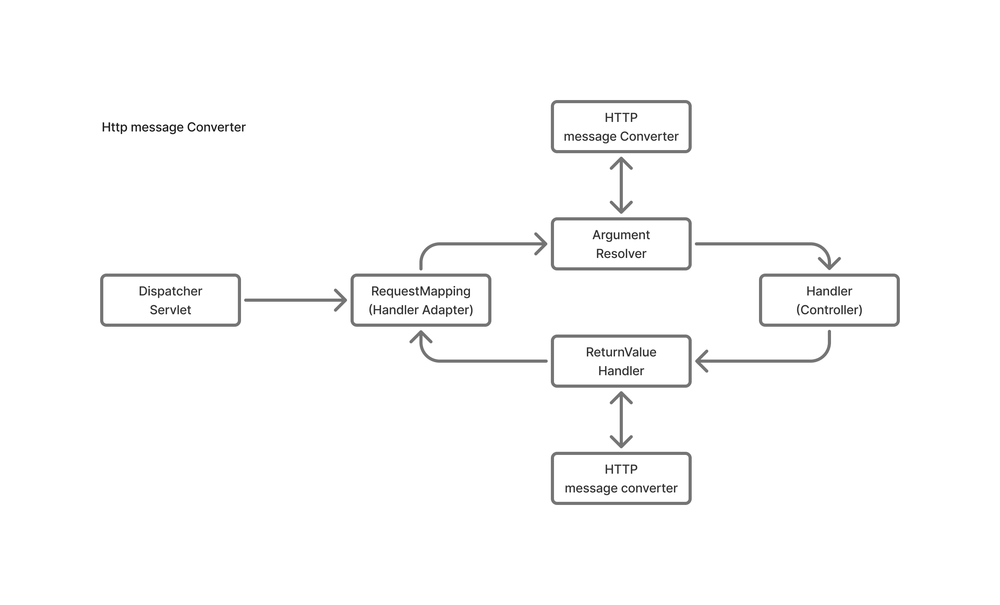

# MessageConverter
Http request / response <-> Spring 사이의 변환을 담당하는 Component.

## Interface 구조
- `canRead`, `canWrite`, `read`, `write` 4개의 핵심 method
- request(response)를 읽을(쓸) 수 있는지 확인하는 can methods
- 실제로 읽(쓰)는 read, write methods

## can methods
- canRead : Request Http의 content-type + method의 parameter type
- canWrite : Request Http의 ACCEPT + method의 return type

아래 순서대로 Converter의 can method를 확인하고 true를 반환하면 호출한다.
```
0 = ByteArrayHttpMessageConverter
1 = StringHttpMessageonverter
2 = MappingJackson2HttpMessageConverter
```

| Converter                             | 지원 타입 (Java)                   | 지원 MediaType                           |
|---------------------------------------|------------------------------------|-------------------------------------------|
| **ByteArrayHttpMessageConverter**     | `byte[]`                           | `application/octet-stream`, `*/*`         |
| **StringHttpMessageConverter**        | `String`, `CharSequence`           | `text/plain`, `text/*`, `*/*`             |
| **MappingJackson2HttpMessageConverter** | 임의의 POJO (Java Bean) 클래스     | `application/json`, `application/*+json` |

## 흐름도


- Argument Resolver : `supportsParameter` method를 통해 특정 paramter를 지원하는지 확인하고, handler가 해당 parameter를 지원하면 `resolveArgument()`를 통해 실제 객체를 생성한다.
- ReturnValueHandler : Argument Resolver와 유사한 방식으로 작동.

## 확장
`HandlerMethodArgumentResolver`, `HandlerMethodReturnValueHandler`, `HttpMessageConverter` 세 method 모두 인터페이스로 제공.

확장이 필요할 경우 `WebMvcConfigurer` 를 상속 받아 스프링 빈으로 등록한다.

잘 쓰이지 않으므로 필요한 경우에 `WebMvcConfigurer`를 검색하여 확장한다.

```java
@Bean
public WebMvcConfigurer webMvcConfigurer() {
    ...
}
```
